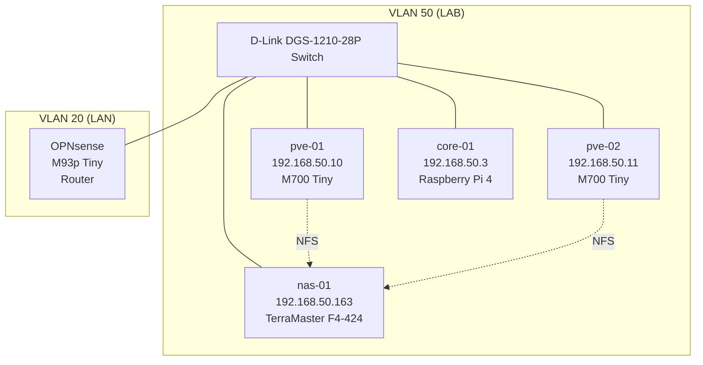

# Proxmox Cluster

## Overview

The fleet's Docker workloads run on a two-node Proxmox VE cluster.
Each node hosts virtual machines and LXC containers, most of which
run Docker daemons that serve the fleet's stacks (Komodo-managed
per ADR-0002). The cluster is not high-availability — nodes are
clustered for shared management only, not for automated failover
or resource migration under fault conditions.

## Nodes

- **`pve-01`** — Lenovo ThinkCentre M700 Tiny, `192.168.50.10`
- **`pve-02`** — Lenovo ThinkCentre M700 Tiny, `192.168.50.11`

Both nodes are on the LAB VLAN (VLAN 50), connected to the same
D-Link DGS-1210-28P switch. There is no dedicated cluster
interconnect — cluster traffic rides the same network as guest
traffic. For a homelab-scale cluster this is fine; it becomes a
consideration if cluster sync competes with guest traffic under load.

### Role assignment

There is no primary or secondary node. Guest placement is
opportunistic — new guests land on whichever node has capacity, and
service distribution across the two nodes is roughly balanced rather
than deliberately partitioned. This means either node's failure
affects roughly half the fleet, and no single node's loss takes down
"the critical half."

## Cluster configuration

The cluster is created via standard `pvecm` join. Both nodes share
the cluster filesystem at `/etc/pve/`, which propagates configuration
between them.

### Quorum

Quorum handling is **not currently verified**. A two-node cluster
without a QDevice has a well-known constraint: loss of either node
causes the surviving node to lose quorum and enter read-only mode
until quorum is restored. This affects operational recovery from
single-node failures — the surviving node can serve running VMs but
cannot make configuration changes, start new VMs, or perform most
management operations.

To check current quorum state:

```
pvecm status
```

If the quorum count shows `2` and expected votes shows `2`, the
cluster is in the default two-node configuration and will hit the
read-only-on-failure behavior. Adding a QDevice (typically a
Raspberry Pi or another always-on device acting as a tiebreaker
voter) resolves this — worth considering as a future improvement
if fleet uptime becomes a concern.

## Adjacent services

Some services architecturally relevant to cluster operation don't
run inside the cluster:

- **OPNsense** on a Lenovo ThinkCentre M93p Tiny handles routing
  between VLANs and to the internet. Loss of OPNsense affects the
  cluster's ability to reach anything outside VLAN 50, including
  DNS queries to AdGuard.
- **AdGuard Home** on `core-01` (Raspberry Pi 4) handles DNS for the
  fleet. Loss of AdGuard breaks `.lan` and `.ts.kazuki.uk` name
  resolution — some cluster operations rely on this for reaching
  storage backends.
- **`nas-01`** (TerraMaster F4-424 running TOS 7) provides storage
  to the cluster via NFS. Detailed storage relationships in the
  Storage section below.

## Storage

<!-- TO BE VERIFIED BY EXECUTOR -->

The cluster uses two storage classes:

- **Local storage** on each node (NVMe/SSD) — hosts ISO images,
  local guest disks that don't need to migrate between nodes, and
  local backup dumps.
- **NFS shared storage** from `nas-01` — used for guest disks that
  benefit from being reachable from either node (enables live
  migration, though this cluster does not have HA configured to
  trigger automatic migration).

Executor will confirm:
- What NFS shares are mounted, at which paths, on which nodes
- Which guests run from local vs. shared storage
- Exact NFS mount options and any performance-affecting settings

## Backup posture

**There is currently no backup solution for the cluster or its
guests.** This is a known gap.

Proxmox Backup Server was mentioned in early planning documents as
running on the secondary node, but this was never actually deployed.
Backup discipline for user-data-bearing guests is planned as part
of the Backrest work (currently blocked externally on TOS ACL
behavior).

Until Backrest is deployed, the fleet operates without a backup
tier for:
- Guest VM state (Proxmox-level backups)
- Guest filesystem contents (application-level backups)
- Fleet configuration (partially mitigated by GitOps — compose files
  in the Forgejo monorepo — but Proxmox host configuration, guest
  configuration, and user data are not backed up)

## Topology diagram



---

# Cold Boot Procedure

## When you need this

The whole fleet is powered off — extended power outage, planned
maintenance, physical relocation. This procedure brings it back to
working state in dependency order.

If only one component failed, this is not the right procedure. See
Recovery scenarios for single-component failures.

> **Status:** parts of this procedure are lived experience (Docker
> restart quirk, verification checkpoints). Parts are inference from
> dependency analysis (Proxmox startup behavior, guest auto-start).
> First real cold boot after writing this will surface gaps — update
> this page with what you actually did.

## Preconditions

- Physical access to the rack (some nodes may need button-press to
  boot depending on BIOS power-on-after-loss settings)
- The M700 Tiny nodes are configured for automatic power-on after
  loss (VERIFY: BIOS setting "AC Power Recovery" set to "Power On")
- `nas-01` requires manual boot — no auto-boot on power restore

## Phase 1 — Network layer (automatic)

Power on the network hardware first if it isn't on separate UPS:

1. OPNsense router (M93p Tiny) — boots automatically
2. D-Link DGS-1210-28P switch — powers on when connected
3. Cisco CAP3602I AP — comes up automatically (not required for
   cluster operation, but useful for reaching the fleet from wifi
   during recovery)

**Verify before proceeding:**

- Can you ping OPNsense's LAB gateway (`192.168.50.1`) from a wired
  device on VLAN 50?
- Can you reach OPNsense's admin UI?

If either fails, do not proceed — the rest of the sequence requires
routing and switching to work.

## Phase 2 — DNS layer (automatic)

`core-01` (Raspberry Pi 4, `192.168.50.3`) auto-boots when power is
restored. AdGuard Home starts automatically on boot.

Home Assistant also runs on `core-01` per Sprint 3n — comes up
alongside AdGuard.

**Verify before proceeding:**

```
# From any wired device on VLAN 50
dig +short home.ts.kazuki.uk @192.168.50.3
dig +short garage-prod-01.lan @192.168.50.3
```

Both should resolve. If AdGuard is not answering, most fleet name
resolution will fail — many later verification steps depend on this.

## Phase 3 — Storage layer (manual)

**`nas-01` requires manual boot.** Physical power button on the
TerraMaster F4-424. Log in to TOS admin UI after boot.

Currently no fleet services depend on `nas-01` being up for their own
boot — the NFS share was originally provisioned for Proxmox Backup
Server, which is not configured. `nas-01` runs its own Docker workloads
(media stack: Jellyfin, arr-stack, qBittorrent, per Sprint 3w) but
these don't gate the cluster's cold boot.

If you're bringing the fleet up under time pressure and NAS services
aren't immediately needed, Phase 3 can be deferred.

**Verify before proceeding (if bringing NAS up now):**

- TOS UI reachable at `nas-01.lan` or `192.168.50.163`
- Docker containers on `nas-01` reachable via Komodo UI (verify after
  Phase 4 — Komodo needs to be up to see them)

## Phase 4 — Proxmox cluster

Both `pve-01` and `pve-02` should auto-boot when power is restored
(VERIFY BIOS setting). No dependency on which boots first — both
need to be up for quorum.

**Verify before proceeding:**

```
# SSH to either node
pvecm status
```

- `Quorate: Yes`
- Two nodes visible in `Membership information`
- No errors in cluster ring

If quorum is not established, check network reachability between the
two nodes — the cluster syncs over VLAN 50, so any switch or VLAN
issue prevents cluster formation.

## Phase 5 — Guest VMs and LXCs

Guests configured with `Start at boot` in Proxmox will come up
automatically after their host node is up.

**Verify per node:**

```
qm list        # KVM guests
pct list       # LXC containers
```

All expected guests should show `running`. If any show `stopped`,
check whether they're configured for auto-start (Proxmox UI → guest →
Options → Start at boot).

## Phase 6 — Docker services (with a known gotcha)

Once Docker guest VMs are running, Docker services start via
`restart: unless-stopped` in their compose files. Most services come
up cleanly on their own.

**Known gotcha: Docker daemon needs a restart on some hosts after
cold boot.** Observed reliably on `proxy-prod-01` and
`docker-prod-01`. Symptoms: containers show as running via
`docker ps` but service endpoints don't respond, Traefik routes
resolve to nothing, or containers show as running but with recent
restart counts.

**Fix:**

```
ssh proxy-prod-01 'sudo systemctl restart docker'
ssh docker-prod-01 'sudo systemctl restart docker'
```

After the restart, containers come back cleanly and services start
responding. Root cause not fully diagnosed — likely related to Docker
daemon starting before the network is fully ready, or before NFS
mounts (if any) are available.

Do this before running the Phase 7 verification checks. If services
still don't respond after the Docker restart, then the problem is
somewhere else and Phase 7 will surface it.

## Phase 7 — Full-fleet verification

Two lived-experience smoke tests that catch most issues:

**Check 1: Homepage weather widget.**

Load `home.ts.kazuki.uk` in a browser. The weather widget should
display current weather for your configured location.

If weather widget renders:
- DNS resolves correctly (AdGuard → Traefik)
- Homepage container is running and healthy
- Homepage can reach the internet (weather API is external)
- Cloudflared tunnel is up (for tailscale-scoped routing to work)

If weather widget doesn't render but Homepage loads:
- Homepage is up but egress is broken — check OPNsense, check
  Cloudflared

If Homepage doesn't load at all:
- DNS or Traefik routing broken — check `dig home.ts.kazuki.uk`
  first, then Traefik logs

**Check 2: Beszel S3 config.**

Load `beszel.ts.kazuki.uk`, navigate to settings, verify the S3
configuration displays correctly.

If S3 config displays:
- Beszel is up
- Beszel can reach Garage (S3 backend on `garage-prod-01`)
- Configuration is loading from Beszel's persistent storage

If S3 config is empty or errored:
- Garage may be unreachable — check `garage-prod-01` guest is
  running, Garage container is running
- Beszel's config volume may not have mounted — check container logs

**Additional spot-checks (optional but useful):**

- Portfolio loads at `kazuki.uk` — confirms Coolify tenant, DNS,
  and public routing all work
- Handbook loads at `handbook.lan` — confirms Coolify tenant,
  AdGuard rewrite
- Komodo UI at `komodo.ts.kazuki.uk` — confirms Komodo Core is up
  and can reach Periphery on each host

## Total time budget

If everything comes up cleanly (no Docker restart needed, no manual
intervention beyond `nas-01` boot): **15-20 minutes** from powering
on the rack to Phase 7 checks passing.

If Docker restart is needed on both hosts (typical): **25-35 minutes.**

If any phase requires diagnosis, add appropriate time. Cold boot
under stress (unexpected outage) typically takes longer because
verification is more paranoid.

---

# Recovery Scenarios

## Current posture

The fleet has been operationally stable enough that reboot has fixed
every issue encountered so far. This section is intentionally thin —
it documents general diagnostic approach and known theoretical
concerns, not lived recovery procedures.

**This section grows with experience.** After any real recovery event,
update this page with what happened, what you tried, and what fixed
it. A runbook that reflects real fleet behavior is more useful than
one that speculates about scenarios that may not apply.

## General approach when something breaks

1. **Notice the symptom.** Homepage widget missing, service returning
   error, node showing red in Komodo, VLAN 50 unreachable.

2. **Try reboot first.** For this fleet, reboot has been sufficient for
   every issue encountered. Reboot scope depends on symptom:
   - Single service broken → restart the container (Komodo UI or SSH)
   - Multiple services on one guest broken → reboot the guest (Proxmox
     UI or SSH)
   - Multiple guests broken on one node → reboot the node (Proxmox UI)
   - Full fleet broken → cold boot procedure (previous section)

3. **If reboot doesn't fix it, diagnose.** Move to the diagnostic tools
   reference below and work outward from the symptom.

## Diagnostic tools reference

Which tool for which class of question:

**Homepage** (`home.ts.kazuki.uk`)
- Fleet-wide service health at a glance
- Weather widget doubles as internet-egress smoke test
- Fastest first-look tool

**Beszel** (`beszel.ts.kazuki.uk`)
- Host resource metrics (CPU, memory, disk, network) per node
- Container-level metrics
- Historical data for "when did this start"

**Uptime Kuma** (URL in fleet inventory — <!-- executor to fill in -->)
- Service reachability history
- Answers "when did X go down" without waiting for the symptom to
  reappear

**Komodo** (`komodo.ts.kazuki.uk`)
- Docker workload state across all managed hosts
- Container logs (via Komodo UI Terminals or Logs)
- Stack deployment status

**Proxmox UI** (per-node)
- Guest state (running, stopped, error)
- Guest console (for VMs that lost network connectivity)
- Node syslog viewer
- Cluster state (Summary panel shows quorum)

**SSH + `journalctl`**
- When Proxmox UI is unreachable or shows nothing useful
- For host-level Docker daemon issues: `journalctl -u docker`
- For host-level services: `journalctl -u <service>`
- For general host state: `journalctl -xe`

**Physical console (KVM/monitor + keyboard)**
- Last resort: when SSH and Proxmox UI both unreachable
- Useful for network issues where the node is up but unreachable
  from LAN
- Useful for boot-time diagnosis if a node isn't coming up cleanly

## Known theoretical concerns

These have not been experienced but are worth being aware of:

### Two-node cluster quorum loss

Documented in Cluster Architecture. Loss of one PVE node causes the
surviving node to enter read-only mode until quorum is restored.
Impact: running guests continue to run, but no configuration changes,
no new guests can start, no live migration.

**If encountered:** the answer is usually "restore the failed node" —
either boot it back up or physically repair it. If restoration will
take extended time, a QDevice can be added as a permanent tiebreaker,
but this is a change to cluster configuration and not something to
do under stress.

Reference: Proxmox docs on QDevice setup:
`https://pve.proxmox.com/wiki/Cluster_Manager#_corosync_external_vote_support`

### Docker daemon degraded state on `proxy-prod-01` or `docker-prod-01`

Documented in Cold Boot Procedure. If reboot doesn't fix things and
the symptom is "containers running but services not responding,"
`sudo systemctl restart docker` on the affected host is the known
fix. Same procedure as cold boot Phase 6.

### NFS mount hung on Proxmox nodes

If `nas-01` becomes unresponsive while Proxmox nodes have active NFS
mounts, mount operations can hang. Would need investigation if
encountered — the standard fix (`umount -f` or `umount -l`) has real
caveats about data integrity for anything actively writing.

Not experienced. First occurrence should be diagnosed carefully rather
than remediated from memory.

## Update discipline

After any real recovery event — even successful reboot-fixed-it ones
— consider adding a brief entry here:

- What was the symptom
- What you noticed first
- What you tried
- What worked
- Any lessons for the general approach section above

Even "reboot fixed it" entries are useful if they capture novel
symptoms. The point of this section is to accumulate real fleet
behavior over time, not to remain a static document.

---

# Adding a new guest

Provisioning is template-clone + cloud-init (VM only — LXC provisioning isn't
covered by this flow) followed by an Ansible playbook that installs the
Docker baseline. Established and proven end-to-end against a throwaway
guest during the Ansible-foundation sprint, and against the first *real*
fresh host (`docker-prod-02`, on `pve-02`) on 2026-09-01.

## Golden templates — one per node

`pve-01`: **VMID 107** (`debian-13-cloudinit-template`).
`pve-02`: **VMID 9000** (`debian-13-cloudinit-template`), built 2026-09-01.

Each node has its own template because the template disk lives on
`local-lvm` (not shared storage) — `qm clone` can't reach across nodes.
Rather than migrate a clone (`qm clone` on `pve-01` → `qm migrate` to
`pve-02`), the fleet keeps an independent template per node.

The cloud-init vendor-data snippet is tracked at
[`proxmox/debian13-vendor.yaml`](https://github.com/meetKazuki/homelab/blob/master/proxmox/debian13-vendor.yaml)
— the live copy is a host-local file at
`/var/lib/vz/snippets/debian13-vendor.yaml` on each PVE node; keep them in
sync (restore from the repo copy if a node is rebuilt). It sets
timezone/locale/guest-agent and renumbers `kazuki` to UID 1001 at first
boot.

Build a new node's template the same way 9000 was: copy `pve-01`'s exact
verified `debian-13-genericcloud-amd64.qcow2` + `SHA512SUMS`, place the
tracked `debian13-vendor.yaml` in `/var/lib/vz/snippets/`, then
`qm create <id> --memory 2048 --cores 2 --cpu host --net0
virtio,bridge=vmbr0,firewall=1 --scsihw virtio-scsi-single --scsi0
local-lvm:0,import-from=<qcow2>,discard=on,iothread=1,ssd=1 --ide2
local-lvm:cloudinit --boot order=scsi0 --serial0 socket --vga serial0
--agent 1 --ostype l26 --ciuser kazuki --ipconfig0 ip=dhcp --cicustom
"vendor=local:snippets/debian13-vendor.yaml"` then `qm template <id>`.
Diff `qm config` against 107 before trusting it — only the VMID, node,
and (deliberately) `ostype: l26` should differ.

## What the template and Ansible handle for a fresh guest

- **`kazuki` UID.** The Debian cloud image makes its first user UID 1000;
  the fleet standard is 1001. The vendor-data snippet renumbers it (user
  and primary group) at first boot, before anyone logs in — verified
  2026-09-01 by a clone-test off template 9000. After boot, confirm:
  `qm guest exec <vmid> -- bash -lc 'id kazuki'` should show
  `uid=1001(kazuki) gid=1001(kazuki)`. If it somehow still says 1000 (an
  older guest, or the runcmd failed), renumber manually while nothing is
  using the account:
  ```
  qm guest exec <vmid> --timeout 120 -- bash -lc '
  loginctl terminate-user kazuki; systemctl stop user@1000.service; sleep 3
  pkill -9 -u 1000; sleep 2
  usermod -u 1001 kazuki && groupmod -g 1001 kazuki
  find / -xdev -uid 1000 -exec chown -h 1001 {} +
  find / -xdev -gid 1000 -exec chgrp -h 1001 {} +'
  ```
- **`svc-docker` / `docker` groups, `kazuki` membership, `/opt/homelab`.**
  The Ansible `baseline` role (gated `baseline_managed: true` in the
  host's `host_vars`) creates all of it ahead of the `docker`/`periphery`
  roles. Set `baseline_managed: true` for any genuinely fresh host; leave
  it unset for adopted ones.

## 1. Clone the template

On the node the guest will live on, clone that node's template (107 on
`pve-01`, 9000 on `pve-02`):

```
qm clone <template-vmid> <new-vmid> --name <hostname> --full
qm set <new-vmid> --cores <n> --memory <mb> --cpu host --onboot 1
qm disk resize <new-vmid> scsi0 <size>G
```

`--full` (not a linked clone) so the new guest doesn't depend on the
template disk staying intact. Pick `<new-vmid>` via `pvesh get
/cluster/nextid` (cluster-wide unique) and a hostname following the
`role-env-index` convention (see Conventions). The template ships at
2 vCPU / 2 GB / 3 GB disk — resize to the real spec here (`--onboot 1`
because the template omits it).

## 2. Inject this host's SSH key, then boot

The fleet uses **per-host SSH keys**, not one fleet-wide key (see
`handbook/docs/getting-started/ssh.md`) — the template intentionally ships
with no key baked in. Generate one for the new host first:

```
ssh-keygen -t ed25519 -C "kazuki@nexus-v -> <hostname>" -f ~/.ssh/id_ed25519_<hostname>
```

Then, on the PVE node (the file just needs to exist on the node running
`qm`, not on the workstation):

```
qm set <new-vmid> --sshkeys <path-to-pubkey-on-the-pve-node>
qm start <new-vmid>
```

Wait for cloud-init to finish (first boot takes a minute or two), then get
the DHCP address via the guest agent:

```
qm guest cmd <new-vmid> network-get-interfaces
```

Add a matching `Host` block to `~/.ssh/config` on `nexus-v` (per-host key,
`IdentitiesOnly yes`). If the address was previously used by some other
DHCP client, `ssh` will refuse with a changed-host-key warning —
`ssh-keygen -R <ip>` clears the stale entry; this is expected for
DHCP-range addresses, not a sign of anything wrong.

## 3. Stable addressing (operator step)

The clone only has a DHCP lease at this point. Add an OPNsense DHCP
reservation for this MAC (`qm config <new-vmid> | grep net0` shows it) if
the host needs a stable IP long-term — this is a UI action, not something
the clone/provision flow does for you.

## 4. Run the baseline playbook

```
cd ansible
# add the host to inventory/hosts.yml first (scratch group for throwaway
# tests; a real fleet group once 4b exists)
ansible-playbook playbooks/provision-baseline.yml --check   # dry run first
ansible-playbook playbooks/provision-baseline.yml
```

This installs Docker CE (DEB822 repo, trixie suite), deploys Komodo
Periphery (`komodo-periphery-sops:2`), and deploys the Hawser agent. See
`ansible/README.md` for the role breakdown and how secrets are wired in.

Verify: `docker ps` shows both containers, `systemctl is-enabled docker`
says `enabled`. Re-running with `--check` should report zero changes — if
it doesn't, that's a role bug, not something to route around.

## 5. Register in Komodo (operator step, real hosts only)

Per ADR-0011 — see `handbook/docs/operations/deploying-a-new-host.md` step 5.
Not needed for throwaway scratch guests.

## Known gotchas (found building the template and first clone)

- **Set `--cpu host` on the template, not the Proxmox default (`kvm64`).**
  The default excludes modern instruction sets (missing SSE4.2 broke
  Hawser's healthcheck binary outright — `Fatal glibc error: CPU does not
  support x86-64-v2`, container ran but never went healthy). Matches
  `docker-prod-01`'s own VM config (`cpu: host`), confirmed live — this
  isn't a template-specific choice, it's the fleet's existing convention,
  the template had just missed it.
- **NIC is `eth0`, not `ens18`.** Earlier planning assumed the predictable-
  naming scheme every other fleet VM uses, but Debian's official
  `genericcloud` image disables predictable network interface naming for
  cross-hypervisor portability. Confirmed live via the guest agent's
  `network-get-interfaces` output. Anything hardcoding `ens18` for a guest
  cloned from this template needs `eth0` instead.
- **`en_NG.UTF-8` needs to be in `/etc/locale.gen` before `locale-gen` will
  generate it.** cloud-init's `locale:` directive calls `locale-gen
  en_NG.UTF-8` as a bare CLI argument, which Debian's `locale-gen` wrapper
  silently no-ops on if that locale isn't also listed in `/etc/locale.gen`
  — no error, just never generated (`locale -a` shows only `C`/`C.utf8`
  afterward, and `LANG` silently falls back to `C.UTF-8`). Fixed in the
  template's vendor-data snippet
  (`/var/lib/vz/snippets/debian13-vendor.yaml` on `pve-01`) by appending
  the entry to `/etc/locale.gen` via `runcmd` before calling `locale-gen`,
  instead of relying on cloud-init's `locale:` key. Timezone (`Africa/Lagos`,
  set via the same `timezone:` cloud-config key) worked correctly on the
  first try — only locale had this problem.
- **A fresh host has never run `docker login` against the private Forgejo
  registry.** Pulling `komodo-periphery-sops:2` fails with "pull access
  denied... no basic auth credentials" otherwise. Not previously documented
  anywhere (including `deploying-a-new-host.md`'s manual Periphery-deploy
  step) — the Ansible periphery role now handles this itself (credential in
  `stacks/komodo-periphery/secrets.enc.env`, a Forgejo PAT scoped
  `read:package`), but if you're ever deploying Periphery by hand on a new
  host outside Ansible, you need this step too.
- **`group_vars`/`host_vars` must live under `ansible/inventory/`, not at
  the `ansible/` top level.** Ansible only auto-discovers them adjacent to
  the inventory file (or the playbook) — a flat `ansible/group_vars/` is
  silently ignored for this repo's layout. Cost an entire failed playbook
  run (`hawser_token` came back undefined) before this was caught.

---

# Adopting an existing guest under Ansible management

Different problem from "Adding a new guest" above: that section is for a
*fresh* clone with nothing running on it yet. This section is for a guest
that's **already running production services**, manually bootstrapped
before Ansible existed for this fleet (every current CT/VM except a truly
new one) — bringing it under declarative management without disturbing
what's already there. Established during Sprint 4b (fleet-wide adoption).

**The core risk:** an install-shaped Ansible role pointed at an already-
configured, running host can churn or restart it. "Adopt" specifically
does **not** mean "run the new-guest playbook against it" — it means
tuning the role until it describes the host's actual current state with
zero drift, *then* applying (which becomes a no-op).

## The discipline

1. **Audit first, read-only.** SSH in, capture the exact running
   container specs — image, env, mounts, `network_mode`, restart policy,
   how it gets its credentials/keys — for whatever the role will touch.
   Don't write a single role change before this is done. Real reality
   almost never matches what the role assumed.
2. **Tune the role to the audit, not the other way around.** Run
   `ansible-playbook ... --check --diff` against a representative host
   repeatedly. Every diff is either a real role bug (fix it) or genuine,
   pre-existing per-host drift (encode it as a `host_vars` override —
   don't silently normalize it away, and don't force one host's
   idiosyncrasy onto the default that every other host will inherit).
   Keep iterating until `--check` reports **zero changes** (or only
   changes you fully understand and can explain — see the false-positive
   note below).
3. **Canary, then verify hard.** Pick the lowest-blast-radius host. Real
   (non-`--check`) run. Immediately capture container ID + `Created` +
   `StartedAt` for every container on the host, plus the Docker daemon's
   `ActiveEnterTimestamp`, and diff before/after — this is the actual
   proof of "nothing was touched," not just "the task said `ok`." Re-run
   `--check` once more to confirm idempotence.
4. **Roll out by ascending blast radius, same discipline every time.**
   A host whose `--check` isn't clean halts the rollout for that host —
   go back to step 2, don't apply anyway.

## Known false positives vs. real signals (learned the hard way, 4b)

- **`get_url` without a `checksum:` param reports `changed` in `--check`
  even when the remote file is byte-identical to what's already there.**
  Verified via `sha256sum` on both sides before trusting this. Harmless,
  but don't skip the verification — confirm it's actually identical
  rather than assuming.
- **`docker_compose_v2`'s `--check` prediction of `ok` is not fully
  reliable when the rendered compose file restructures a host's existing
  YAML** (map-style `environment:` → list-style, unquoted → quoted
  ports, reordered keys) even though the resolved config is semantically
  identical. `--check` predicted `ok`; the real run on `docker-prod-01`
  (the one host with divergent YAML style) **actually recreated the
  container** — Compose's own idempotency hash is apparently sensitive to
  serialized form in a way the Ansible module's check-mode simulation
  doesn't replicate. No harm resulted here (persistent volume preserved
  the identity key, container reconnected cleanly, nothing else on the
  host touched) but treat this as a real limit, not a one-off: **if a
  host's live compose file structurally differs from your template's
  style, check-mode's `ok` is not proof of safety** — verify with
  before/after container IDs regardless of what `--check` said.
- **`docker_login` / any task that needs a registry credential should
  run as the user who actually holds it, not root** — check
  `~/.docker/config.json` for both `root` and the SSH login user before
  assuming `become: true` is the right default. On this fleet, `root`
  has no Docker credential store on any host; the SSH login user
  (`kazuki`, docker-group member) holds it everywhere.
- **File ownership/mode drift across "identical" hosts is real, not a
  bug in your audit.** 4b found `/opt/homelab/komodo-periphery`'s mode
  varying between `02775`/`0775`/`02755` across otherwise-identical
  hosts, and file-level group ownership (`svc-docker` vs. the login
  user's own primary group) varying independently of the directory's own
  group. Preserve each host's actual value via `host_vars` rather than
  picking one and normalizing — this is unexplained historical drift,
  not a deliberate setting worth enforcing.

## Per-host exception profile (as of Sprint 4b)

| Host | Deviates from standard how |
|---|---|
| `docker-prod-01` (VM) | `ens18` interface, not `eth0`; DEB822 apt repo format (every other host uses the legacy one-line format); Periphery gets `PERIPHERY_CORE_PUBLIC_KEYS`/`KOMODO_CORE_ADDRESS`/`PERIPHERY_PASSKEYS` via `env_file: .env` instead of inline; no Hawser (runs Dockhand server itself, manages own host via local socket) |
| `plane-prod-01`, `coolify-prod-01`, `garage-prod-01` | `periphery_stack_dir` mode `0775` (no setgid), not `02775`; files inside group-owned by `kazuki`, not `svc-docker` |
| `garage-prod-01` | Also hardcodes `PERIPHERY_CORE_PUBLIC_KEYS` directly in `compose.yml` instead of the `${VAR}` + `.env` pattern every other standard host uses |
| `proxy-prod-01` | Compose file's two key-related volume lines (`./keys`, age-keys mount) are in the opposite order from every other host — cosmetic only |
| `komodo-prod-01` | Not managed by the Periphery role at all (`periphery_managed: false`) — its Periphery is the vanilla (non-`-sops`) image bundled inside its own `komodo` stack, keys on a Docker-managed volume, not `/opt/homelab`. Bootstrap-circularity exclusion, same class as the rest of this fleet's Komodo-orchestrator exceptions. No Hawser. |
| `forgejo-prod-01` | The one genuine (non-adoption) install this sprint — no pre-existing Periphery to match |

**Hawser is not adoptable via Ansible on this fleet, and isn't attempted.**
It's deployed entirely as a normal Komodo-managed Stack (from this repo's
git checkout under `/etc/komodo/repos/.../stacks/hawser/`), not at any
fixed filesystem path outside Komodo's control — unlike Periphery, which
*has* to be bootstrapped outside Komodo (same bootstrap-circularity logic
as `komodo-prod-01`'s own exclusion). The `ansible/roles/hawser` role
exists (used by the 4a scratch/test path only) but isn't wired into the
real-fleet play. Revisit deliberately in a future sprint if there's a
reason to change this, rather than assuming the existing role just needs
tuning.

---

# Adding a new node

Established Sprint 4c as a **documented, config-validated process** — not
proven end-to-end against real hardware yet (no physical node was
commissioned that sprint; see the honesty-boundary note at the end of
this section). First real use of this procedure is the proof; update this
section with what actually happened.

Artifacts live in `proxmox/` (answer-file template, render
script, first-boot hook) and `ansible/roles/proxmox_node/` (post-install
role). See `proxmox/README.md` for the full file-by-file
breakdown and the fleet-reality audit (network shape, locale, disk
layout, repo config, Netdata/Beszel install method) it's built from.

## 1. Physical setup (operator step)

BIOS: enable virtualization extensions (VT-x/AMD-V), set AC power
recovery to "always on" (matches `pve-01`/`pve-02` — both auto-boot on
power restore per this runbook's Power/Reboot section above). Cable to
the same L2 segment as the existing cluster (`192.168.50.0/24`, no
VLAN — confirmed on both existing nodes, Sprint 4c Phase 0 audit). No
disk-level pre-configuration needed; the auto-installer partitions from
the answer file.

## 2. Generate the per-node SSH key (operator step, on `nexus-v`)

```
ssh-keygen -t ed25519 -C "kazuki@nexus-v -> <hostname>" -f ~/.ssh/id_ed25519_<hostname>
```

Matches the fleet's per-host key convention (see
`handbook/docs/getting-started/ssh.md`) — same pattern as "Adding a new
guest" above.

## 3. Prerequisites on the trusted PVE node (config-validated: yes, this sprint)

The node running `prepare-iso` needs:

- `proxmox-auto-install-assistant` (apt package, `pve-no-subscription`
  repo — confirmed available and installable on PVE 9.2, Sprint 4c).
  **Not installed by default** — `sudo apt-get install -y
  proxmox-auto-install-assistant`. Note: `kazuki`'s `sudo` on `pve-01`
  requires an interactive password (not NOPASSWD — a documented,
  pre-standardization exception, see CLAUDE.md); this is an operator
  step for that reason, not an Ansible/executor one.
- `sops` + `age`, fleet age key at `~/.config/sops/age/keys.txt`.
  **Confirmed absent on both `pve-01` and `pve-02` as of Sprint 4c.**
  **Design decision (secrets-deploy-fix sprint, 2026-08-04): this gap
  will not be closed by installing `sops`/`age` on the PVE nodes.**
  Operator decided against baking the fleet's `age` *private* key onto
  the hypervisors — render the answer file on `nexus-v` instead, and
  ship only the rendered artifacts (no `sops`/`age` needed on the
  trusted PVE node at all). The `render-answer.sh` code rewire to
  actually do this (render on `nexus-v`, copy the two output files to
  the PVE node rather than running the script there) is **deferred to
  the next real node-bake** — no bake is currently pending, so the
  script below still describes the old on-node-decrypt shape until
  that rewire happens. Do not install `sops`/`age` on `pve-01`/`pve-02`
  as a stopgap; render on `nexus-v` instead even before the script is
  updated (manually copy `answer.<hostname>.toml` and
  `<hostname>.first-boot-hook.sh` to the PVE node afterward).
- The PVE 9.2 ISO itself. `kazuki` cannot write to
  `/var/lib/vz/template/iso/` (root-owned) — download to `/tmp` instead
  (confirmed working, Sprint 4c: `https://enterprise.proxmox.com/iso/proxmox-ve_9.2-1.iso`,
  VERIFY current version at execution time).

## 4. Render the answer file + first-boot hook (config-validated: yes)

On the trusted PVE node, with this repo checked out (or just
`proxmox/` copied over):

```
./render-answer.sh <hostname> <mgmt-cidr> <disk-model-filter> <ssh-pubkey-file> [fqdn-domain] [out-file]
```

Writes a real, filled `answer.<hostname>.toml` (root password decrypted
from `secrets.enc.env` via `sops`) and a matching
`<hostname>.first-boot-hook.sh`, both gitignored — **never commit
either.** `FQDN_DOMAIN` has no fleet-wide default: `pve-01` and
`pve-02` disagree even internally about their own domain suffix
(`pve1.home` vs `pve.home` on `pve-01`; see `proxmox/README.md`)
— decide this per node, don't assume a pattern.

## 5. Validate and prepare the ISO (config-validated: yes — real output below)

```
proxmox-auto-install-assistant validate-answer answer.<hostname>.toml
proxmox-auto-install-assistant prepare-iso <source.iso> \
  --fetch-from iso \
  --answer-file answer.<hostname>.toml \
  --on-first-boot <hostname>.first-boot-hook.sh \
  --output <dest.iso>
```

Real `validate-answer` and `prepare-iso` runs against a filled example
(placeholder host values, dummy password) are captured in the Sprint 4c
status report — a clean `validate-answer` and a produced, unbooted ISO
are the sprint's primary dry-proof. Neither step touches a live host.

## 6. Write to boot media and boot the target (await-first-real-hardware)

Write the prepared ISO to a USB stick (`dd` or Balena Etcher), boot the
target node from it. **Not performed this sprint — no hardware.**

## 7. First boot (await-first-real-hardware)

The embedded hook (ordering `fully-up`) creates `kazuki` (UID 1001,
sudo-group), installs the node's SSH pubkey, asserts
`openssh-server`/`python3`. Written and shellcheck-clean, but **its
correctness against a real installed system is unproven** — verify
manually (`ssh kazuki@<hostname>`) before trusting it in future runs.

## 8. Run the `proxmox_node` role (await-first-real-hardware)

```
cd ansible
ansible-playbook playbooks/provision-proxmox-node.yml --check --diff   # dry run first
ansible-playbook playbooks/provision-proxmox-node.yml
```

Add the host to `inventory/hosts.yml` under a `proxmox_nodes` group
first (doesn't exist yet — no real node to populate it with). Handles
repo config (disable `pve-enterprise`, enable `pve-no-subscription`),
Netdata + Beszel agent install (Beszel needs per-node `KEY`/`TOKEN` —
operator issues these in the Beszel hub UI first, see
`ansible/roles/proxmox_node/defaults/main.yml`), `kazuki` NOPASSWD sudo,
and — if `proxmox_node_cluster_join` (default `true`) — `pvecm add`
against the existing cluster.

`ansible-lint` (production profile) and `--syntax-check` pass clean
(Sprint 4c). **The role has never been run against any host — no
target exists.** Its idempotence and real-world correctness are
unproven; the discipline from "Adopting an existing guest" above
(audit → tune-to-clean-check → canary) is the model to follow once
hardware exists, not something this role has been through yet.

## 9. Cluster join is a real topology decision, not a silent default

The cluster (`nexus-homelab`, `pve-01` nodeid 1 + `pve-02` nodeid 2, no
QDevice, no HA — confirmed live via `/etc/corosync/corosync.conf`,
Sprint 4c) is currently 2-node by design. A 3rd node **improves**
quorum math (true majority becomes possible instead of requiring both
original nodes) — but it's a deliberate topology change worth naming
before running the role with `proxmox_node_cluster_join: true`, not an
assumed side effect of "adding a node." Set `proxmox_node_cluster_join:
false` for a standalone node.

## 10. Verify (await-first-real-hardware)

- `pvecm status` shows the new node; both existing nodes see it
- Netdata/Beszel dashboards show the new node reporting
- `ansible-playbook ... --check` reports zero changes (idempotence)
- Guest migration or initial guest placement — not covered here, a
  separate operational decision once the node is real

## Honesty boundary (Sprint 4c)

Steps 1–5 are real, executed proofs against `pve-01`/`pve-02`'s actual
audited configuration. Steps 6–10 are written and statically validated
only (shellcheck / ansible-lint / `--syntax-check`) — **no physical
node has ever gone through this process end-to-end.** Don't read a
clean `ansible-lint` or a produced ISO as proof the hook or role work
correctly on real hardware; that proof is deferred to first real use.
Update this section with real findings the first time it happens —
this runbook, like the rest of this repo, describes fleet reality, not
aspiration.

---

# Storage management

<!-- TBA — depends on executor discovery of current storage state -->

Not yet documented. Storage relationships in Cluster Architecture
above are marked for executor verification; once verified, this
section should cover:

- Adding a new NFS share from `nas-01` to the cluster
- Adding local storage to a node (new disk, ZFS pool operations)
- Growing an existing guest disk (both local-storage and NFS-storage
  cases)
- Storage pool health monitoring (Proxmox UI Storage view, TOS UI
  for NAS-side)
- What to do when a storage backend becomes unresponsive

Fill in after executor has confirmed actual storage configuration.

---

# Network configuration

<!-- TBA -->

Not yet documented. Fleet network model is:

- Router: OPNsense on M93p Tiny (not in Proxmox cluster)
- Switch: D-Link DGS-1210-28P (managed)
- VLANs per `00 - Home Server Setup.md`:

| Name | VLAN | Subnet | Purpose |
|---|---|---|---|
| WAN | 10 | ISP DHCP | Public internet |
| LAN | 20 | 192.168.10.0/24 | Management core |
| ADMIN | 30 | 192.168.30.0/24 | Unrestricted access |
| IoT | 40 | 192.168.40.0/24 | IoT isolated |
| LAB | 50 | 192.168.50.0/24 | Proxmox / NAS / fleet |
| HOME | 60 | 192.168.60.0/24 | Personal devices |
| GUEST | 70 | 192.168.70.0/24 | Guest isolated |

The cluster and all its guests live on VLAN 50 (LAB).

When you fill this section in, cover:

- Proxmox bridge configuration on each node (which bridge maps to
  which VLAN, whether tagged or untagged)
- Adding a new bridge for a different VLAN (if a guest ever needs to
  be on ADMIN or IoT)
- Firewall rules that affect cluster operation (OPNsense rules
  allowing/blocking inter-VLAN traffic)
- DNS forwarding chain (client → AdGuard on `core-01` → upstream
  resolvers via OPNsense)

---

# Upgrade discipline

<!-- TBA -->

Not yet documented. Proxmox VE has a defined upgrade path — no-subscription
repos, major version upgrades require specific procedure — but this
hasn't been exercised on this fleet yet.

When you first upgrade PVE:

- Version pinning and repository configuration (`/etc/apt/sources.list.d/`)
- The `pve7to8` or equivalent upgrade check tool
- Order of operations (upgrade one node while guests run on the other,
  verify, upgrade second node)
- Kernel updates and reboot requirements
- ZFS pool upgrades (if applicable — VERIFY whether any storage is on ZFS)

Reference: Proxmox upgrade documentation:
`https://pve.proxmox.com/wiki/Upgrade_from_7_to_8`

Update this section with what actually happened during the upgrade,
not what the docs said would happen. The two often differ.

---

# Common maintenance

<!-- TBA -->

Not yet documented. Periodic tasks that keep the cluster healthy:

- Cluster health check: `pvecm status`, verify quorum and node
  membership
- Storage utilization check: Proxmox UI Storage view per node,
  Beszel disk metrics
- Log rotation: verify `/var/log` isn't growing unbounded on either
  node
- Package updates: Proxmox no-subscription updates, cadence TBD
- Backup verification: once Backrest is deployed, this section covers
  "did last night's backup actually run"

Fill in as you discover what maintenance actually matters. Some things
that look like they should be regular maintenance (log rotation,
disk cleanup) may be handled automatically by defaults — don't
document work you don't actually do.

---

# Backup and restore

<!-- TBA — currently no backup solution exists -->

**There is no backup solution for the cluster or its guests currently.**
This section will be written when Backrest is deployed (currently
blocked externally on TOS ACL behavior).

When Backrest is live, cover:

- What Backrest backs up (which paths on which guests)
- Backup destination (NFS on `nas-01`, remote storage, or both)
- Restore procedure (theoretical or tested — document honestly)
- Backup verification (how you know backups are actually working)

Reference the Sprint 3v Forgejo backup runbook
(`handbook/docs/operations/restoring-forgejo.md`) for the theoretical
restore-runbook pattern. Same discipline: document what would work
based on Backrest's own restore procedures, mark as theoretical
until tested, update with real findings after first real restore.

---

# Known quirks

Not yet fully documented. Accumulate here as you hit them:

- Docker daemon needs `systemctl restart` on `proxy-prod-01` and
  `docker-prod-01` after cold boot (documented in Cold Boot Phase 6)
- Two-node cluster quorum behavior (documented in Cluster Architecture)
- `proxy-prod-01` disk fill from an unrotated Traefik access log (below)
- A rotated `FORGEJO_REGISTRY_TOKEN` can authenticate against Forgejo's
  generic login endpoint successfully while still 401ing on the actual
  image pull — looks like an Ansible/credential-wiring bug but isn't;
  it's the token's registry-package scope. Diagnosed (Sprint 4b) by
  comparing SHA256 hashes of the credential Ansible wrote vs. what's
  committed in `secrets.enc.env` (never print the raw secret) — if they
  match but the pull still 401s, the token itself needs regenerating
  with package-read scope in Forgejo's UI, not further shell debugging.
- Anything else weird that took time to figure out

The purpose of this section is to preserve tacit knowledge — the
"if you see X, it's usually Y" wisdom that's only obvious once you've
been bitten. If you spend more than 30 minutes debugging something,
add it here so future-you doesn't repeat the diagnosis.

### proxy-prod-01 disk fill from an unrotated Traefik access log

**Symptom:** Beszel disk usage on `proxy-prod-01` climbs over weeks/months
into yellow/red territory. First hit at 75.9%→78% (2026-07-24).

**Cause — not what you'd guess first.** The obvious suspect is Docker's
default `json-file` log driver (no size cap by default), and that *is*
a real, secondary contributor (Traefik's own container stdout log grew
to 947MB uncapped). But the dominant cause (7.2GB, ~60% of this host's
16GB disk) was different: Traefik is configured
(`traefik.yml`'s `accessLog.filePath: /var/log/traefik/access.log`) to
write its access log to a **file**, bind-mounted from the host at
`/opt/homelab/gateway/traefik/logs/` (`compose.yml`'s
`./traefik/logs:/var/log/traefik`). This bypasses Docker's logging
system entirely — daemon-level `log-opts` (`max-size`/`max-file`) have
**zero effect** on it, because Docker's log driver never sees these
log lines.

`access.log` had been growing unrotated since 2026-06-22 (32 days).
Seven older gzipped generations (`access.log.1.gz`–`.7.gz`) sat in the
same directory, all dated exactly that timestamp — evidence that some
prior rotation mechanism existed and stopped (plausibly at a stack
redeploy that recreated the bind mount), rather than never having
existed. No `/etc/logrotate.d/` entry existed for this path even
though system `logrotate` itself was installed and running on its
normal daily timer — it simply had nothing telling it about this file.

**Diagnosis sequence:**

1. Confirm which filesystem: `df -h`
2. Docker-level accounting: `docker system df -v` — check this
   *first* and don't assume Docker is the culprit just because
   containers are involved; here it showed <2GB total, 0% reclaimable
3. Top-level: `sudo du -xh --max-depth=1 /` — in this case `/opt`
   outweighed `/var` (where Docker itself lives), which is the tell
   that the culprit is a bind-mounted file, not Docker's own state
4. Walk down the largest top-level dir with repeated
   `du -sh <dir>/*/` until you hit the actual file(s)
5. For any oversized file: `stat` it — birth time and mtime tell you
   whether it's actively growing and since when
6. Cross-check `journalctl --disk-usage` and `docker images -f
   dangling=true` — small/zero in this case, ruling those out fast

**Fix:**

1. Immediate: `sudo truncate -s 0` on the oversized file (not `rm` —
   the process holds it open). Recovered 78%→22% disk usage instantly.
2. Structural, for a bind-mounted app-level log file: a real
   `/etc/logrotate.d/` entry targeting the actual file path, with
   `copytruncate` (the app holds the file open, doesn't reopen on
   signal) — this is what actually prevents recurrence, not
   `daemon.json`.
3. Structural, for the secondary Docker-level container stdout logs:
   `/etc/docker/daemon.json` with `log-opts.max-size`/`max-file` still
   worth doing, but note it **only applies to containers at creation
   time** — a plain `docker restart` or daemon restart does **not**
   retroactively apply new `log-opts` to already-running containers.
   Confirmed via `docker inspect <name> --format
   '{{.HostConfig.LogConfig}}'` showing an empty `log-opts` map on
   every container after a daemon restart. To actually apply it to
   existing containers, they must be recreated:
   `docker compose up -d --force-recreate` from the stack's directory.

**Prevention:**

- Logrotate config added at `/etc/logrotate.d/traefik-access` on
  `proxy-prod-01`, targeting `/opt/homelab/gateway/traefik/logs/access.log`,
  `daily`, `maxsize 200M` (rotates on whichever comes first), `rotate 7`,
  `copytruncate`, `compress`/`delaycompress`.
- `/etc/docker/daemon.json` added with `max-size: 50m`, `max-file: 3`;
  `traefik` and `crowdsec` containers force-recreated to pick it up
  immediately (verified via `docker inspect`). `hawser`,
  `komodo-periphery`, and `beszel-agent` were left as-is (negligible
  log volume) — they'll pick up the new default whenever next
  recreated for any reason.
- If this pattern appears on other hosts (any host running a service
  configured to write its own log file to a bind mount, not just
  stdout), check for a matching `/etc/logrotate.d/` entry — don't
  assume `daemon.json` alone covers it.

**Sprint 3v Docker restart pattern applies:** the daemon restart used
here (to pick up `daemon.json`) is the same operation documented in
Cold Boot Procedure Phase 6.
